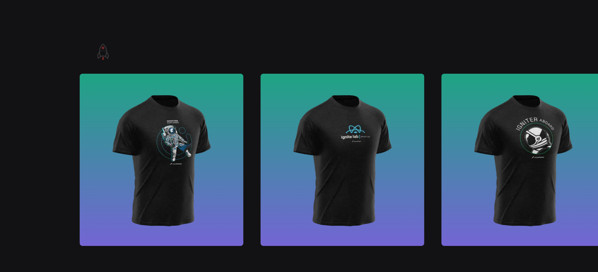

<div align="center" style="margin-bottom: 20px;">

</div>

<div align="center" style="margin: 20px;">

</div>

## The Project

This application simulates a t-shirt purchasing website until the purchase is completed.

##  About the Application

###  Features

- Simple and objective interface

- Carousel

- Loading screen

- Purchase page

- Api


###  Used Technologies

Some of the technologies used in this project are:
- [TypeScript](https://www.typescriptlang.org/)
- [NextJS](https://nextjs.org/)
- [ReactJS](https://pt-br.reactjs.org/)
- [Styled-Components](https://styled-components.com/)
{...}

## Running the Project
#### Clone Repository
```sh
$ git clone https://github.com/AlexandreeDev/shop-nextjs

```
#### Starting the API


```
https://stripe.com/br/payments/checkout
```
#### Starting the web
```
$ npm run dev &&  yarn dev

Open http://localhost:3000 with your browser to see the result.
```

<p align="center" style="margin-top: 20px; border-top: 1px solid #eee; padding-top: 20px;">Made with :purple_heart: by <strong> Alexandre J. Ferreira</strong> </p>